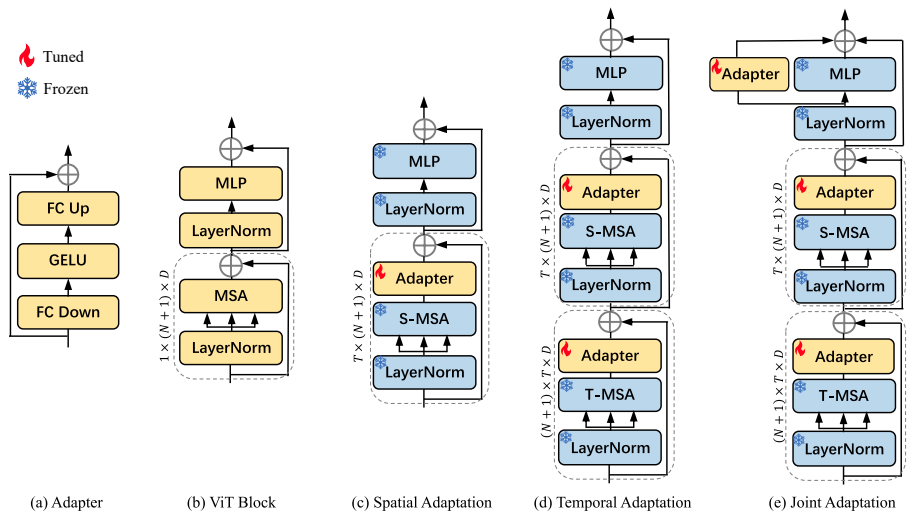
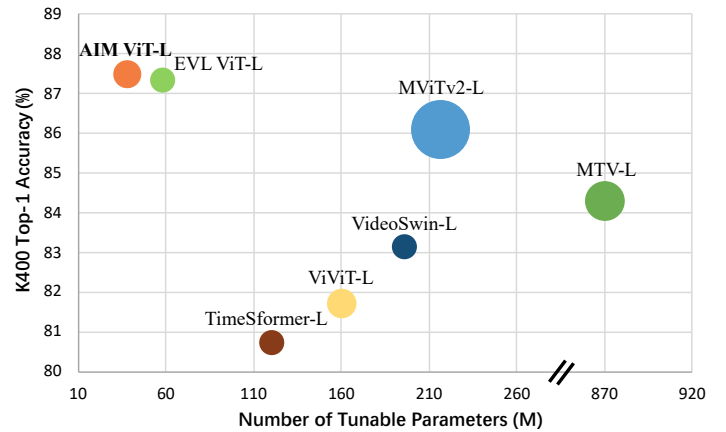

# AIM: Adapting Image Models for Efficient Video Action Recognition

This repo is the official implementation of ["AIM: Adapting Image Models for Efficient Video Action Recognition"](https://openreview.net/pdf?id=CIoSZ_HKHS7) at ICLR 2023.

If you find our work useful in your research, please cite:
```
@inproceedings{
    yang2023aim,
    title={{AIM}: Adapting Image Models for Efficient Video Action Recognition},
    author={Taojiannan Yang and Yi Zhu and Yusheng Xie and Aston Zhang and Chen Chen and Mu Li},
    booktitle={The Eleventh International Conference on Learning Representations },
    year={2023},
    url={https://openreview.net/forum?id=CIoSZ_HKHS7}
}
```

## Introduction

In this work, we propose a novel method to Adapt pre-trained Image Models (AIM) for efficient video understanding. By freezing the pre-trained image model and adding a few lightweight Adapters, we introduce spatial adaptation, temporal adaptation and joint adaptation to gradually equip an image model with spatiotemporal reasoning capability. The overall structure of the proposed method is shown in the figure below.

<p></p>

During training, only Adapters are updated, which largely saves the training cost while still achieve competitive performance with SoTA full finetuned video models. As shown in the figure below, AIM outperforms previous SoTA methods while using less number of tunable parameters and inference GFLOPs.

<p></p>

## Installation

The codes are based on [VideoSwin](https://github.com/SwinTransformer/Video-Swin-Transformer), which is based on [MMAction2](https://github.com/open-mmlab/mmaction2). To prepare the environment, please follow the following instructions.
```shell
# create virtual environment
conda create -n AIM python=3.7.13
conda activate AIM

# install pytorch
conda install pytorch==1.10.0 torchvision==0.11.0 torchaudio==0.10.0 cudatoolkit=11.3 -c pytorch -c conda-forge

# install CLIP
pip install git+https://github.com/openai/CLIP.git

# install other requirements
pip install -r requirements.txt

# install mmaction2
python setup.py develop
```
### Install Apex:
We use apex for mixed precision training by default. To install apex, please follow the instructions in the [repo](https://github.com/NVIDIA/apex).

If you would like to disable apex, comment out the following code block in the [configuration files](configs/recognition/vit/):
```
# do not use mmcv version fp16
fp16 = None
optimizer_config = dict(
    type="DistOptimizerHook",
    update_interval=1,
    grad_clip=None,
    coalesce=True,
    bucket_size_mb=-1,
    use_fp16=True,
)
```

## Data Preparation
The codes are based on [MMAction2](https://github.com/open-mmlab/mmaction2). You can refer to [MMAction2](https://github.com/open-mmlab/mmaction2) for a general guideline on how to prepare the data. All the datasets ([K400](https://github.com/open-mmlab/mmaction2/blob/master/tools/data/kinetics/README.md), [K700](https://github.com/open-mmlab/mmaction2/blob/master/tools/data/kinetics/README.md), [SSv2](https://github.com/open-mmlab/mmaction2/blob/master/tools/data/sthv2/README.md) and [Diving-48](https://github.com/open-mmlab/mmaction2/blob/master/tools/data/diving48/README.md)) used in this work are supported in [MMAction2](https://github.com/open-mmlab/mmaction2).

## Training
The training configs of different experiments are provided in `configs/recognition/vit/`. To run experiments, please use the following command. `PATH/TO/CONFIG` is the training config you want to use. The default training setting is 8GPU with a batchsize of 64.
```shell
bash tools/dist_train.sh <PATH/TO/CONFIG> <NUM_GPU> --test-last --validate --cfg-options model.backbone.pretrained=openaiclip work_dir=<PATH/TO/OUTPUT>
```
We also provide a training script in `run_exp.sh`. You can simply change the training config to train different models.

### Key Files
- The model is implemented in https://github.com/taoyang1122/adapt-image-models/blob/main/mmaction/models/backbones/vit_clip.py. You may refer to it on how to apply AIM to your model.
- The weights are frozen at https://github.com/taoyang1122/adapt-image-models/blob/main/tools/train.py#L187.

## Evaluation
The code will do the evaluation after training. If you would like to evaluate a model only, please use the following command,
```shell
bash tools/dist_test.sh <PATH/TO/CONFIG> <CHECKPOINT_FILE> <NUM_GPU> --eval top_k_accuracy
```

## Models

### Kinetics 400

| Backbone |  Pretrain   | GFLOPs | Param | Tunable Param | acc@1 | acc@5 | Views | Checkpoint |
| :---: | :---: | :---: | :---: | :---: | :---: | :---: | :---: | :---: |
| ViT-B/16 | CLIP | 606 | 97 | 11 | 83.9 | 96.3 | 8x3x1 | [checkpoint](https://drive.google.com/file/d/1oRmpP47Z6jWq4NHEpONNGAeKgDTFVNEO/view?usp=share_link) |
| ViT-B/16 | CLIP | 1214 | 97 | 11 | 84.5 | 96.6 | 16x3x1 | [checkpoint](https://drive.google.com/file/d/1QuCjDcQUNVyH8_LBjITQMUGIehogb_k8/view?usp=share_link) |
| ViT-B/16 | CLIP | 2428 | 97 | 11 | 84.7 | 96.7 | 32x3x1 | [checkpoint](https://drive.google.com/file/d/1hwlxj51naOpY2WG9FosX45voQgpUbEn4/view?usp=share_link) |
| ViT-L/14 | CLIP | 2902 | 341 | 38 | 86.8 | 97.2 | 8x3x1 | [checkpoint](https://drive.google.com/file/d/1pR6n2UxA3zJsWjAJhTJXJqaPEJYYfBOQ/view?usp=share_link) |
| ViT-L/14 | CLIP | 5604 | 341 | 38 | 87.3 | 97.6 | 16x3x1 | [checkpoint](https://drive.google.com/file/d/1X7lqRYTbyMfO3L0zZXACEdIm21NU4Soc/view?usp=share_link) |
| ViT-L/14 | CLIP | 11208 | 341 | 38 | 87.5 | 97.7 | 32x3x1 | [checkpoint](https://drive.google.com/file/d/1W1v53x8FAiVBTkAB0pIUUQUF-6hN_y2J/view?usp=share_link) |

### Kinetics 700

| Backbone |  Pretrain   | GFLOPs | Param | Tunable Param | acc@1 | Views | Checkpoint |
| :---: | :---: | :---: | :---: | :---: | :---: | :---: | :---: |
| ViT-B/16 | CLIP | 7284 | 97 | 11 | 76.9 | 32x3x3 | [checkpoint](https://drive.google.com/file/d/1XG1BL81jx9ibJz7HNY8ZPke84FnIkbqz/view?usp=share_link) |
| ViT-L/14 | CLIP | 33624 | 341 | 38 | 80.4 | 32x3x3 |

### Diving-48

| Backbone |  Pretrain   | GFLOPs | Param | Tunable Param | acc@1 | Views | Checkpoint |
| :---: | :---: | :---: | :---: | :---: | :---: | :---: | :---: |
| ViT-B/16 | CLIP | 809 | 97 | 11 | 88.9 | 32x1x1 | [checkpoint](https://drive.google.com/file/d/1YMEWV8HM0v1hkq3-35gNGjh_DMDeC-cn/view?usp=share_link) |
| ViT-L/14 | CLIP | 3736 | 341 | 38 | 90.6 | 32x1x1 |

## TODO

- [ ] Pretrained model weights

## Security

See [CONTRIBUTING](CONTRIBUTING.md#security-issue-notifications) for more information.

## License

This project is licensed under the Apache-2.0 License.

